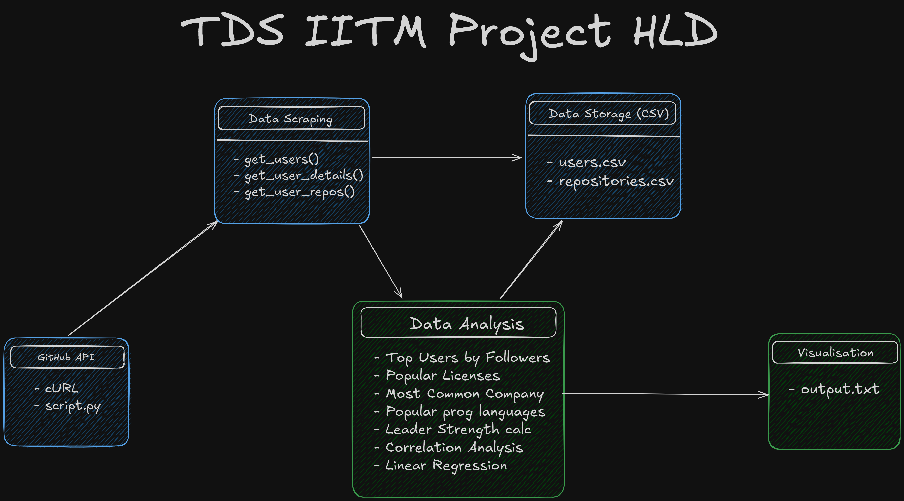

# iitm-tds-project1

This project is a Python script that scrapes GitHub for user and repository data, focusing on users located in Tokyo with over 200 followers.

## Key Points

- The data was scraped from the GitHub API using Python's requests library and cURL commands to make auth GET requests to specific URL endpoints, structured as https://api.github.com/users/{username} for user details and https://api.github.com/users/{username}/repos for repositories, with results saved as CSV files(users.csv and repositories.csv) for analysis.
- A surprising finding from the data analysis was that many users have minimal public repositories despite having a large number of followers as can be seen in **curl-followers-tokyo.json**, indicating potential engagement without active project contributions.
- Developers are recommended to focus on building a presence on GitHub by contributing to open-source projects, as active participation can enhance their experience, learning and attract more followers.

## My Approach
HLD for this project:


1. **API Requests**: I used cURL to make API requests to the GitHub API to retrieve user and repository data. The data was saved as JSON files **curl-followers-tokyo.json** for further analysis.

2. **Data Analysis**: I then created a Python script **script.py** to collect all the data and save it as CSV files(users.csv and repositories.csv).

3. **Data Visualization**: I used the Pandas library to analyze the data and generate insights to answer the 16 questions on the portal. The script **analyze.py** or **analyze.ipynb** reads the CSV files and generates visualizations to identify trends and patterns in the data.

## Prerequisites

- Python 3.x
- `requests` and `python-dotenv` libraries

## Installation

1. Clone the repository:

   ```bash
    git clone https://github.com/anshulbaliga7/iitm-tds-project1
    ```
2. Install the required libraries:

   ```bash
   pip install -r requirements.txt
   ```
3. Create a `.env` file in the project root directory and add your GitHub API token:

   ```bash
    GITHUB_API_TOKEN=your_token_here
    ```
4. Run the script:

   ```bash
   python script.py
   ```

5. Check the generated CSV files.

6. Run the script to analyze the data:

   ```bash
    python analyze.py
    ```